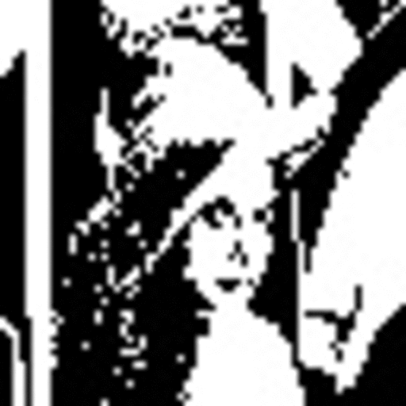
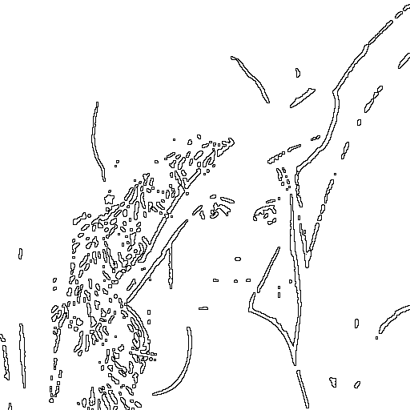

# NTU Computer Vision Homework
Homeworks of NTU CSIE Computer Vision(922 U0610)

Course Website : [Link](http://cv2.csie.ntu.edu.tw/CV/)

## 3rdparty
* CMake : `3.16.0`
* OpenCV : `3.4.3`

## Outline
|HW|Topic|
|-|-|
|HW1|[Basic Image Manipulation](hw1/HW1.md)|
|HW2|[Connecting Components](hw2/HW2.md)|
|HW3|[Histogram Equalization](hw3/HW3.md)|
|HW4|[Mathematical Morphology - Binary Morphology]|
|HW5|[Mathematical Morphology - Gray Scale Morphology]|
|HW6|[Yokoi Connectivity Number]|
|HW7|[Thinning Operator]|
|HW8|[Noise Removal]|
|HW9|[General Edge Detection]|
|HW10|[Zero Crossing Edge Detection]|

## Homeworks
|[Homework 1](hw1/HW1.md)|[Homework 2](hw2/HW2.md)|[Homework 3](hw3/HW3.md)|
|-|-|-|
||||
|Homework 4|Homework 5|Homework 6|
||||
|Homework 7|Homework 8|Homework 9|
||||
|Homework 10|-|-|
||-|-|

