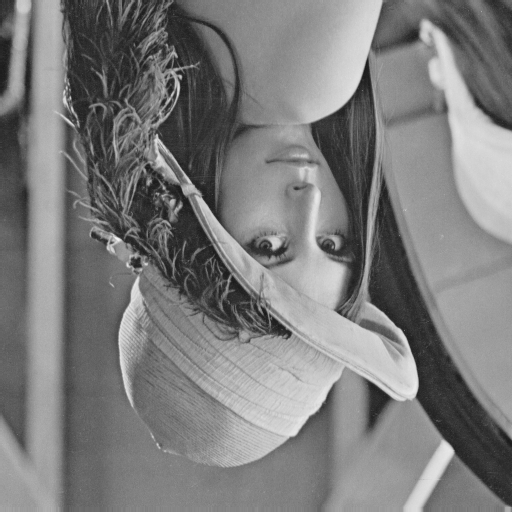
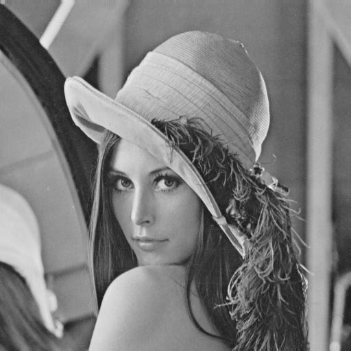
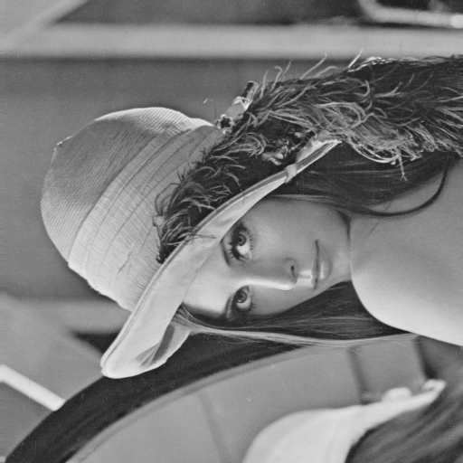
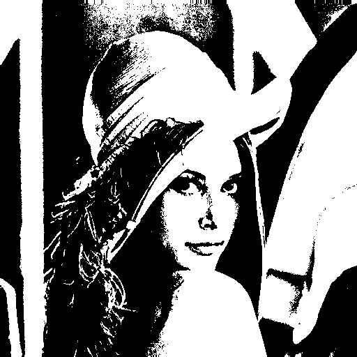

# Homework 1 - Basic Image Manipulation
### Origin Iamge


### Usage
```
cd hw1
mkdir build && cd build
cmake ..
make
cd ..
./build/hw1 data/lena.bmp
```
All generated images are saved in `demo`

## Description
### Part 1
Write a program to do the following requirement.

(a) upside-down lena.bmp


    
(b) right-side-left lena.bmp


    
(c) diagonally flip lena.bmp



### Part 2 
Write a program or use software to do the following requirement.
    
(d) rotate lena.bmp 45 degrees clockwise


(e) shrink lena.bmp in half


(f) binarize lena.bmp at 128 to get a binary image

