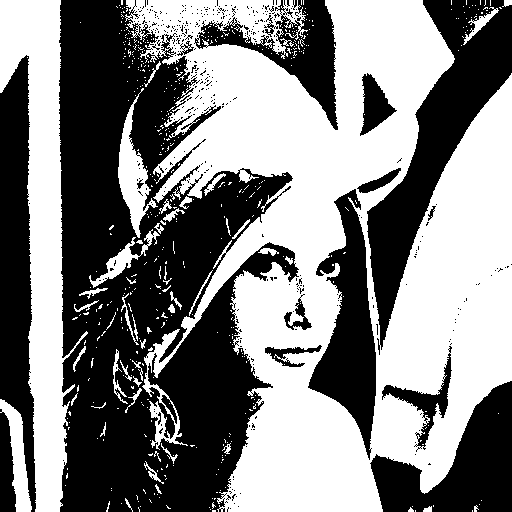
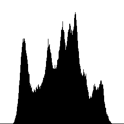

# Homework 2 - Basic Image Manipulation


### Usage
```
cd hw2
mkdir build && cd build
cmake ..
make
cd ..
./build/hw2 data/lena.bmp
```
All generated images are saved in `demo`

## Description
Write a program to generate:

(a) a binary image (threshold at 128)



(b) a histogram



(c) connected components (regions with + at centroid, bounding box)