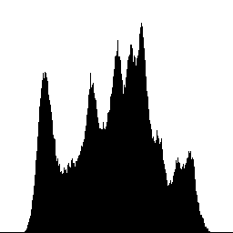
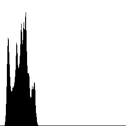
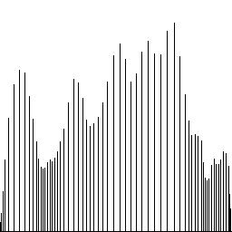

# Homework 3 - Histogram Equalization
### Origin Iamge


### Usage
```
cd hw3
mkdir build && cd build
cmake ..
make
cd ..
./build/hw3 data/lena.bmp
```
All generated images are saved in `demo`

## Description
Write a program to generate images and histograms:

(a) original image and its histogram

|Image|histogram|
|-|-|
|||

(b) image with intensity divided by 3 and its histogram

|Image|histogram|
|-|-|
|||

(c) image after applying histogram equalization to (b) and its histogram

|Image|histogram|
|-|-|
|||